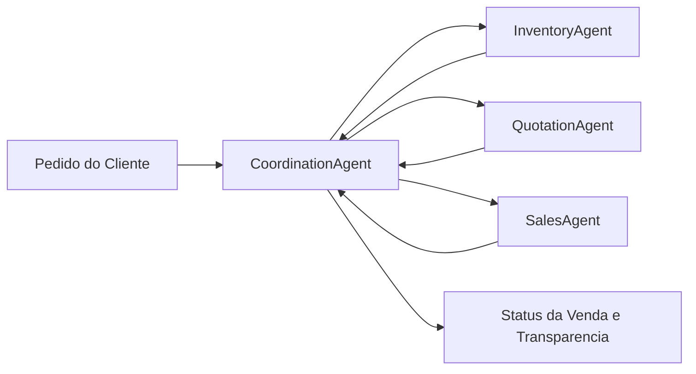

# Multi-Agent Project

This Python project simulates a multi-agent sales system for a paper company, with specialized agents responsible for stock, pricing, and order closure.

## Overview

The project separates responsibilities across sales-focused agents:

- `CoordinationAgent`: receives customer orders and orchestrates the sales workflow.
- `InventoryAgent`: manages paper stock, checks availability, and reserves items.
- `QuotationAgent`: calculates price, applies discounts, and generates proposals.
- `SalesAgent`: confirms the sale, registers transactions, and updates sale status.

The system behavior is validated with automated tests using `pytest`.

## Architecture Diagram



## Agent Interaction

1. `CoordinationAgent` receives the customer order and validates order data.
2. `InventoryAgent` checks stock availability and reserves paper items.
3. `QuotationAgent` calculates subtotal, applies discount rules, and generates the proposal.
4. `SalesAgent` confirms the order, records the transaction, and tracks sale status.
5. `CoordinationAgent` consolidates all updates and returns the final sales outcome.

## Project Structure

```text
multiagent-project/
├─ tasks.json
├─ data/
│  ├─ tasks_resources.json
│  └─ orders.json
├─ src/
│  ├─ helpers/
│  │  └─ utils.py
│  └─ agents/
│     ├─ coordination.py
│     ├─ inventory.py
│     ├─ quotation.py
│     ├─ sales.py
│     ├─ task.py
│     └─ resource.py
├─ tests/
│  ├─ test_coordination.py
│  ├─ test_inventory.py
│  ├─ test_quotation.py
│  ├─ test_sales.py
│  ├─ test_task.py
│  ├─ test_resource.py
│  └─ test_utils.py
├─ requirements.txt
└─ REPORT.md
```

## Requirements

- Python 3.11 or later
- `pip`
- The dependencies listed in `requirements.txt`

## Installation

Run the following commands in a Windows PowerShell terminal from the project root:

```powershell
python -m venv .venv
.\.venv\Scripts\Activate.ps1
python -m pip install --upgrade pip
python -m pip install -r requirements.txt
```

## Running the Tests

```powershell
python -m pytest -q
```

## Example Behavior

In the sales flow, when an order arrives, `CoordinationAgent` routes it through inventory, quotation, and sales confirmation:

```python
result = coordination_agent.distribute_order(
	{"client": "Empresa X", "quantity": 100, "paper_type": "A4"}
)
```

After processing, the order result contains the proposal and transaction status.

## Technologies

- Python
- Pytest

## License

No license has been defined in the repository yet.

