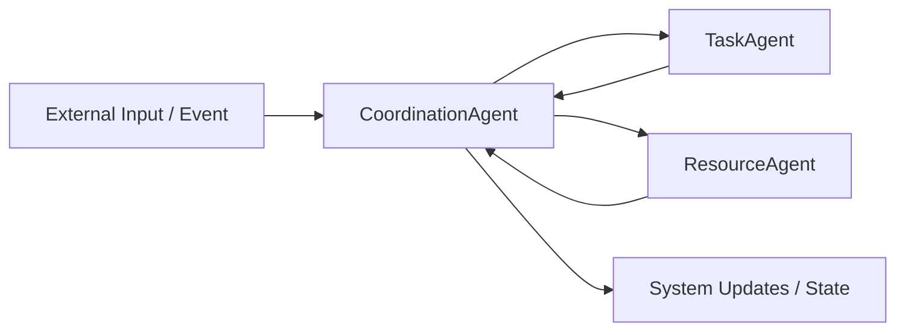

# Multi-Agent Project

This Python project simulates a multi-agent system with specialized agents for coordination, tasks, and resources.

## Overview

The project separates responsibilities across three agents:

- `CoordinationAgent`: receives and centralizes updates and messages.
- `TaskAgent`: handles rules and operations related to tasks.
- `ResourceAgent`: handles rules and operations related to resources.

The system behavior is validated with automated tests using `pytest`.

## Architecture Diagram



## Agent Interaction

1. `CoordinationAgent` acts as the central orchestrator, receiving messages and updates.
2. `TaskAgent` processes task-related decisions and reports results back to `CoordinationAgent`.
3. `ResourceAgent` processes resource-related decisions and also reports results back to `CoordinationAgent`.
4. `CoordinationAgent` consolidates all responses and keeps the system state updated.

## Project Structure

```text
multiagent-project/
├─ tasks.json
├─ data/
│  └─ tasks_resources.json
├─ src/
│  ├─ __init__.py
│  └─ agents/
│     ├─ __init__.py
│     ├─ coordination.py
│     ├─ task.py
│     └─ resource.py
├─ tests/
│  ├─ test_coordination.py
│  ├─ test_task.py
│  ├─ test_resource.py
│  └─ test_utils.py
├─ requirements.txt
└─ REPORT.md
```

## Requirements

- Python 3.11 or later
- `pip`
- The dependencies listed in `requirements.txt`

## Installation

Run the following commands in a Windows PowerShell terminal from the project root:

```powershell
python -m venv .venv
.\.venv\Scripts\Activate.ps1
python -m pip install --upgrade pip
python -m pip install -r requirements.txt
```

## Running the Tests

```powershell
python -m pytest -q
```

## Example Behavior

In the coordination test, when the agent receives a message, it should store that message in its `updates` collection:

```python
agent.receive("Test message")
```

After that, `"Test message"` should be present in `agent.updates`.

## Technologies

- Python
- Pytest

## License

No license has been defined in the repository yet.

